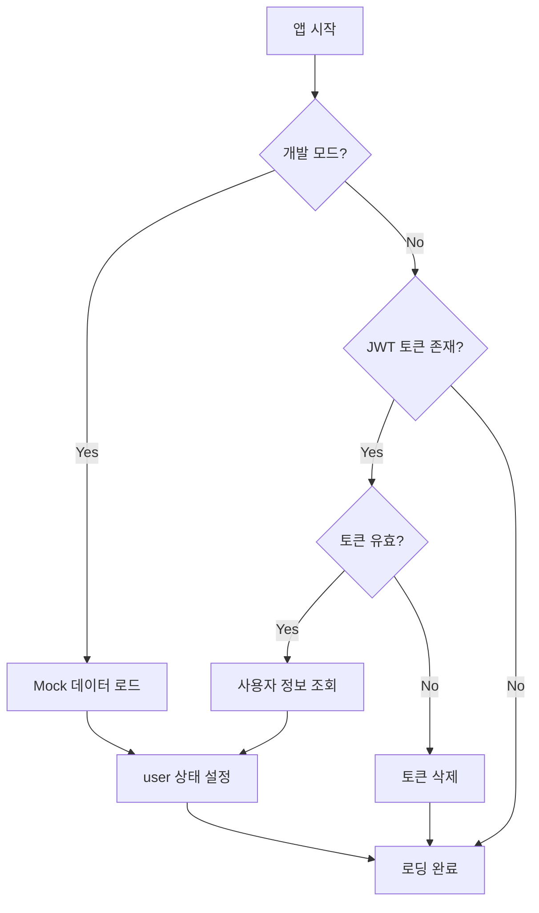
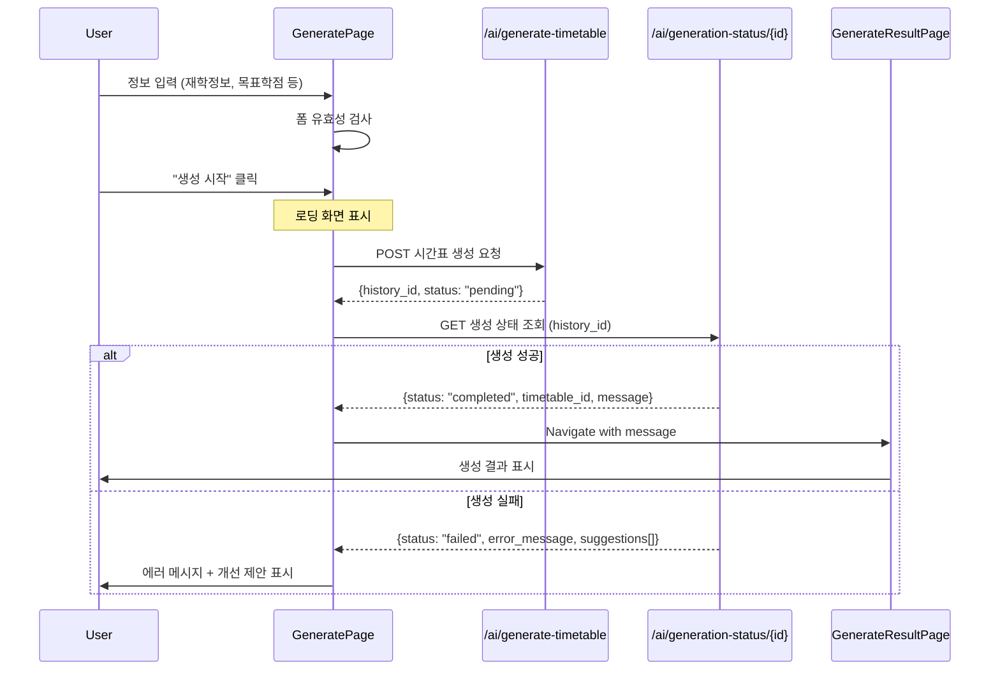
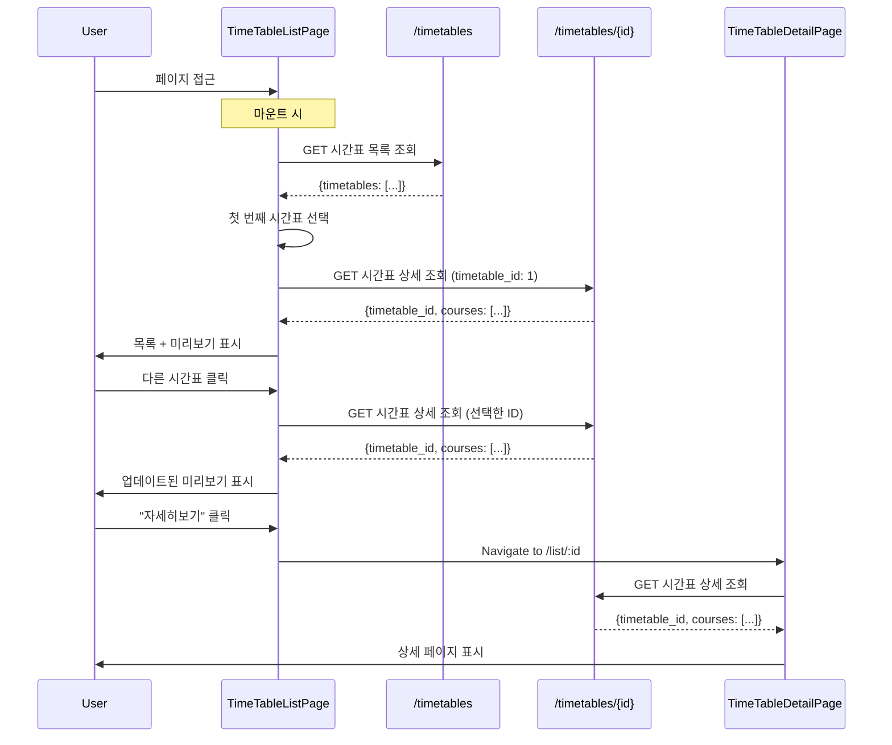

# TimeWizard 아키텍처 문서

## 목차
1. [프로젝트 구조](#프로젝트-구조)
2. [UserContext 시스템](#usercontext-시스템)
3. [Generate 페이지 플로우](#generate-페이지-플로우)
4. [List 페이지 플로우](#list-페이지-플로우)
5. [API 명세](#api-명세)
6. [개선 제안사항](#개선-제안사항)

---

## 프로젝트 구조

### 폴더 구조
```
src/
├── apis/                    # API 호출 함수 및 타입
│   ├── AIGenerateAPI/      # AI 시간표 생성 API
│   ├── TimeTableAPI/       # 시간표 조회 API
│   └── UserAPI/            # 사용자 정보 API
│
├── contexts/               # React Context (전역 상태)
│   └── UserContext.tsx    # 사용자 정보 전역 관리
│
├── pages/                  # 페이지 컴포넌트 (실제 로직)
│   ├── generate/
│   │   ├── GeneratePage.tsx         # 시간표 생성 페이지
│   │   ├── GenerateResultPage.tsx   # 생성 결과 페이지
│   │   └── types.ts
│   ├── list/
│   │   ├── TimeTableListPage.tsx    # 시간표 목록 페이지
│   │   ├── TimeTableDetailPage.tsx  # 시간표 상세 페이지
│   │   ├── CourseItem/              # 강의 아이템 컴포넌트
│   │   └── types.ts
│   └── main/
│       └── MainPage.tsx             # 메인 대시보드
│
└── routes/                 # 라우팅 정의 (TanStack Router)
    ├── generate/
    │   ├── index.tsx              # /generate
    │   └── $gentimetableId.tsx    # /generate/:id
    ├── list/
    │   ├── index.tsx              # /list
    │   └── $timetableId.tsx       # /list/:id
    └── main/
        └── index.tsx              # /main
```

### 설계 원칙
- **routes**: 라우팅 정의만 담당 (~10줄)
- **pages**: 실제 비즈니스 로직 + UI
- **apis**: API 호출 및 타입 정의
- **contexts**: 전역 상태 관리

---

## UserContext 시스템

### 개요
`UserContext`는 앱 전체에서 사용자 정보를 관리하는 전역 상태 시스템입니다.

### 주요 기능

#### 1. TokenManager (JWT 토큰 관리)
```typescript
TokenManager = {
  setToken(token: string)      // 로컬스토리지에 JWT 저장
  getToken(): string | null    // JWT 가져오기
  removeToken()                // JWT 삭제
  isTokenValid(): boolean      // JWT 유효성 검사 (만료 체크)
}
```

#### 2. UserContext 제공 값
```typescript
{
  user: User | null           // 현재 로그인한 사용자 정보
  loading: boolean            // 사용자 정보 로딩 중
  error: Error | null         // 에러 정보
  isAuthenticated: boolean    // 로그인 여부
  fetchUser()                 // 사용자 정보 새로고침
  updateUser(user)            // 로컬 상태만 업데이트
  clearUser()                 // 사용자 정보 초기화
  login(token)                // 로그인 (토큰 저장 + 정보 조회)
  logout()                    // 로그아웃 (토큰 삭제 + 상태 초기화)
}
```

### 사용 방법

#### Provider 설정 (App.tsx)
```tsx
import { UserProvider } from '@/contexts/UserContext'

function App() {
  return (
    <UserProvider>
      <RouterProvider router={router} />
    </UserProvider>
  )
}
```

#### 컴포넌트에서 사용
```tsx
import { useUser } from '@/contexts/UserContext'

function MyComponent() {
  const { user, loading } = useUser()

  if (loading) return <div>로딩 중...</div>

  return <div>안녕하세요, {user?.university}!</div>
}
```

### 초기화 플로우



**현재 상태 (개발용)**
- 개발 모드에서는 자동으로 Mock 사용자 데이터 로드
- 토큰 검증 로직은 주석 처리됨
- 프로덕션에서는 JWT 토큰 기반 인증 사용 예정

---

## Generate 페이지 플로우

### 페이지 구성
1. **GeneratePage** (`/generate`)
   - 시간표 생성 조건 입력
   - AI 시간표 생성 요청

2. **GenerateResultPage** (`/generate/:id`)
   - 생성된 시간표 표시
   - AI 메시지 출력
   - 저장/재생성 옵션

### API 호출 순서



### GeneratePage 상세 플로우

#### 1. 초기화 (useEffect)
```typescript
useEffect(() => {
  if (user) {
    // UserContext에서 사용자 정보 자동 채우기
    setUniversity(user.university)
    setMajor(user.major)
    setGrade(user.grade)
    setCompletedCredits(user.completed_credits)
    // ... 기타 재학 정보
  }
}, [user])
```

#### 2. 폼 유효성 검사
```typescript
const isFormValid =
  university.trim() !== '' &&
  major.trim() !== '' &&
  grade.trim() !== '' &&
  semester.trim() !== '' &&
  completedCredits.trim() !== '' &&
  majorCreditsCompleted.trim() !== '' &&
  generalCredits.trim() !== '' &&
  totalCredits.trim() !== '' &&
  majorCredits.trim() !== ''
```

#### 3. 생성 요청 (handleGenerate)
```typescript
async function handleGenerate() {
  setIsGenerating(true)

  try {
    // 1단계: 시간표 생성 시작
    const generateResponse = await mockGenerateTimetable({
      semester: "2025-1",
      target_credits: Number(totalCredits),
      preferences: {
        preferred_days: excludedDays,
        preferred_start_time: excludedTimes[0]?.startTime,
        preferred_end_time: excludedTimes[0]?.endTime,
      }
    })

    const historyId = generateResponse.data.history_id

    // 2단계: 생성 상태 조회
    const statusResponse = await mockGetGenerationStatus(historyId)

    if (statusResponse.data.status === 'completed') {
      // 생성 성공 - 결과 페이지로 이동
      navigate({
        to: `/generate/${statusResponse.data.timetable_id}`,
        search: { message: statusResponse.data.message }
      })
    } else if (statusResponse.data.status === 'failed') {
      // 생성 실패 - 에러 메시지 표시
      alert(`${statusResponse.data.error_message}\n\n개선 제안:\n- ${suggestions}`)
    }
  } finally {
    setIsGenerating(false)
  }
}
```

### GenerateResultPage 상세 플로우

#### 1. Props 및 초기화
```typescript
interface GenerateResultPageProps {
  gentimetableId: string      // URL params에서 받음
  message: string             // search params에서 받음 (AI 메시지)
}

// 초기 상태
const [aiMessage] = useState(message)           // 수정 불가
const [timetableName, setTimetableName] = useState('')  // 수정 가능
const [feedback, setFeedback] = useState('')           // 수정 요청
```

#### 2. 시간표 데이터 로드
```typescript
useEffect(() => {
  const fetchTimetable = async () => {
    const response = await mockGetTimeTableDetail(Number(gentimetableId))
    if (response.success) {
      setTimetable(response.data)
    }
  }
  fetchTimetable()
}, [gentimetableId])
```

### 데이터 모델

#### GenerateTimetableRequest
```typescript
{
  semester: string                    // "2025-1"
  target_credits: number             // 목표 학점
  preferences: {
    preferred_days?: string[]        // 선호 요일
    preferred_start_time?: string    // 선호 시작 시간
    preferred_end_time?: string      // 선호 종료 시간
    required_courses?: number[]      // 필수 수강 과목
    excluded_courses?: number[]      // 제외 과목
  }
}
```

#### GenerationStatusResponse (성공)
```typescript
{
  success: true
  data: {
    history_id: number
    status: "completed"
    timetable_id: number          // 생성된 시간표 ID
    message: string               // AI가 생성한 설명 메시지
  }
}
```

#### GenerationStatusResponse (실패)
```typescript
{
  success: true
  data: {
    status: "failed"
    error_message: string
    suggestions: string[]         // 개선 제안 목록
  }
}
```

---

## List 페이지 플로우

### 페이지 구성
1. **TimeTableListPage** (`/list`)
   - 사용자의 모든 시간표 목록
   - 선택한 시간표 미리보기

2. **TimeTableDetailPage** (`/list/:id`)
   - 시간표 상세 정보
   - 강의 목록 + 시간표

### API 호출 순서



### TimeTableListPage 상세 플로우

#### 1. 초기화 (useEffect)
```typescript
useEffect(() => {
  const fetchTimeTables = async () => {
    // 1. 시간표 목록 조회
    const response = await mockGetTimeTables()
    setTimeTables(response.data.timetables)
  }

  fetchTimeTables()

  // 2. 첫 번째 시간표 자동 선택
  handleTimeTableClick(1)
}, [])
```

#### 2. 시간표 선택 핸들러
```typescript
const handleTimeTableClick = async (timetableId: number) => {
  // 선택한 시간표 상세 정보 조회
  const response = await mockGetTimeTableDetail(timetableId)

  if (response.success) {
    setSelectedTimeTable(response.data)  // 미리보기 업데이트
    setActiveTimeTable(timetableId)      // 활성화 표시
  }
}
```

#### 3. 상태 관리
```typescript
const [timeTables, setTimeTables] = useState<TimeTableItem[]>([])
  // 사용자의 모든 시간표 목록

const [activeTimeTable, setActiveTimeTable] = useState<number | null>(1)
  // 현재 선택된 시간표 ID

const [selectedTimeTable, setSelectedTimeTable] = useState<TimeTableDetail | null>(null)
  // 선택한 시간표의 전체 상세 정보 (강의 목록 포함)
```

### TimeTableDetailPage 상세 플로우

#### 1. Props 및 초기화
```typescript
interface TimeTableDetailPageProps {
  timetableId: string    // URL params에서 받음
}

const [activeCourseId, setActiveCourseId] = useState<number | undefined>(1)
  // 현재 하이라이팅된 강의 ID
```

#### 2. 데이터 로드
```typescript
useEffect(() => {
  const fetchTimetable = async () => {
    const response = await mockGetTimeTableDetail(Number(timetableId))
    if (response.success) {
      setTimetable(response.data)
    }
  }
  fetchTimetable()
}, [timetableId])
```

#### 3. 강의 색상 할당
```typescript
const courseColors = useMemo(() => {
  if (!timetable) return new Map<number, string>()
  return assignCourseColors(timetable.courses)
  // 같은 course_id는 같은 색상
  // 다른 course_id는 최대한 다른 색상
}, [timetable])
```

#### 4. 호버 인터랙션
```typescript
const handleCourseItemHover = (course_id: number) => {
  setActiveCourseId(course_id)
  // CourseItem 위에 마우스 올리면 시간표에서 해당 강의 하이라이팅
}
```

### 데이터 모델

#### TimeTableItem (목록용)
```typescript
{
  timetable_id: number
  timetable_name: string
  semester: string
  total_credits: number
  is_ai_generated: boolean
  is_main: boolean
  created_at: string
}
```

#### TimeTableDetail (상세용)
```typescript
{
  timetable_id: number
  timetable_name: string
  semester: string
  total_credits: number
  is_ai_generated: boolean
  is_main: boolean
  course_count: number
  courses: Course[]          // 강의 목록
}
```

#### Course
```typescript
{
  course_id: number
  course_name: string
  professor: string
  location: string
  day_of_week: string       // "월", "화", ...
  start_time: string        // "09:00"
  end_time: string          // "10:30"
  credits: number
}
```

---

## API 명세

### 1. User API

#### GET /users/me
사용자 정보 조회

**Response**
```json
{
  "success": true,
  "data": {
    "user_id": 1,
    "nickname": "TimeWizard",
    "university": "한양대학교 ERICA",
    "major": "컴퓨터학부",
    "grade": 3,
    "completed_credits": 90,
    "major_credits": 65,
    "general_credits": 25,
    "graduation_credits": 140
  }
}
```

### 2. TimeTable API

#### GET /timetables
시간표 목록 조회

**Response**
```json
{
  "success": true,
  "data": {
    "timetables": [
      {
        "timetable_id": 1,
        "timetable_name": "2024-2학기 시간표",
        "semester": "2024-2",
        "total_credits": 18,
        "is_ai_generated": true,
        "is_main": true,
        "created_at": "2024-11-01"
      }
    ]
  }
}
```

#### GET /timetables/:id
시간표 상세 조회

**Response**
```json
{
  "success": true,
  "data": {
    "timetable_id": 1,
    "timetable_name": "2024-2학기 시간표",
    "semester": "2024-2",
    "total_credits": 18,
    "is_ai_generated": true,
    "is_main": true,
    "course_count": 5,
    "courses": [
      {
        "course_id": 101,
        "course_name": "인간공학과디자인",
        "professor": "이준",
        "location": "라운즈홀 507호",
        "day_of_week": "월",
        "start_time": "09:00",
        "end_time": "11:00",
        "credits": 3
      }
    ]
  }
}
```

### 3. AI Generate API

#### POST /ai/generate-timetable
AI 시간표 생성 요청

**Request**
```json
{
  "semester": "2025-1",
  "target_credits": 18,
  "preferences": {
    "preferred_days": ["월요일", "수요일"],
    "preferred_start_time": "09:00",
    "preferred_end_time": "18:00",
    "required_courses": [101, 102],
    "excluded_courses": [201]
  }
}
```

**Response**
```json
{
  "success": true,
  "data": {
    "history_id": 42,
    "status": "pending",
    "message": "시간표 생성이 시작되었습니다. 잠시만 기다려주세요."
  }
}
```

#### GET /ai/generation-status/:history_id
생성 상태 조회

**Response (성공)**
```json
{
  "success": true,
  "data": {
    "history_id": 42,
    "status": "completed",
    "timetable_id": 5,
    "message": "컴퓨터공학 3학년 1학기 교과를 포함한 시간표를 직접한 공강일 공강 선호, 줄임이면 9시 수업을 제외했습니다. 9시 과목이는 출석잘해야, 칭찬 받을거에요!!!"
  }
}
```

**Response (실패)**
```json
{
  "success": true,
  "data": {
    "status": "failed",
    "error_message": "조건을 만족하는 시간표를 생성할 수 없습니다.",
    "suggestions": [
      "목표 학점을 낮춰보세요.",
      "제외 시간대를 줄여보세요.",
      "필수 과목을 조정해보세요."
    ]
  }
}
```

---

## 개발 vs 프로덕션

### 현재 개발 환경
- **Mock API 사용**: 모든 API는 `mock*` 함수 사용
- **자동 로그인**: 개발 모드에서 Mock 사용자 자동 로드
- **토큰 검증 생략**: JWT 토큰 검사 로직 주석 처리

### 프로덕션 전환 시
1. **UserContext**: 주석 처리된 토큰 검증 로직 활성화
2. **API 호출**: `mock*` 함수를 실제 API 함수로 변경
3. **환경 변수**: API 엔드포인트 설정

```typescript
// 변경 예시
// const response = await mockGenerateTimetable(requestData)
const response = await generateTimetable(requestData)
```

---

## 참고 자료

- **TanStack Router**: https://tanstack.com/router
- **React Context**: https://react.dev/reference/react/useContext
- **JWT**: https://jwt.io/

---

**작성일**: 2025-11-09
**버전**: 1.0
